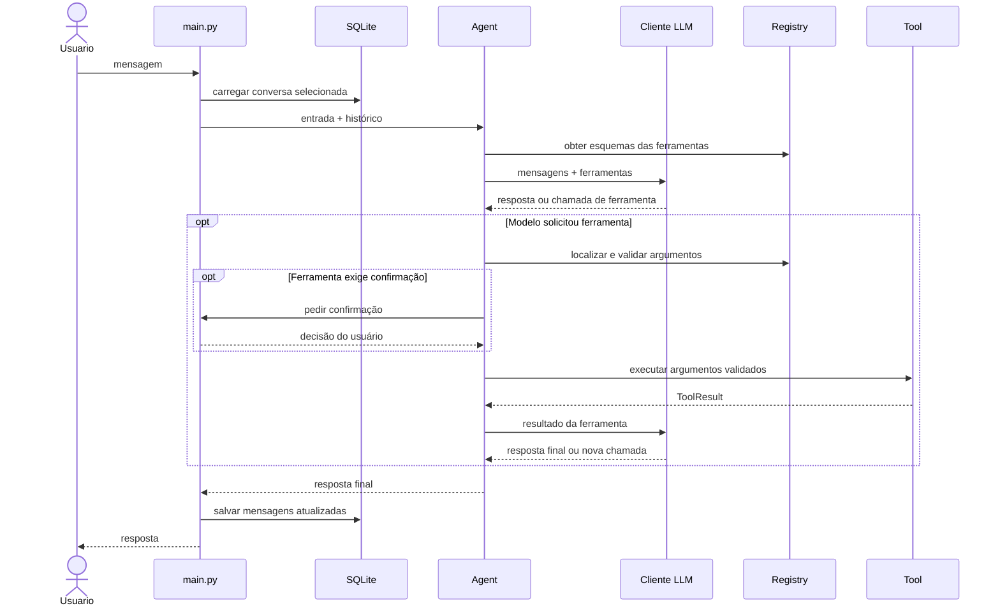

# Arquitetura do Local Agent

Este documento descreve como o código está separado, como uma mensagem percorre o sistema e como adicionar ferramentas sem concentrar as responsabilidades em um único módulo.

## Mapa do repositório

```text
local-agent/
├── main.py                    # Interface de terminal e comandos de conversa
├── agent/
│   ├── config.py               # Configuração validada na composição da aplicação
│   ├── core/
│   │   ├── agent.py            # Orquestração do modelo e das ferramentas
│   │   └── history.py          # Persistência de conversas em SQLite
│   ├── llm/
│   │   └── client.py           # Adaptador para endpoint compatível com OpenAI
│   └── tools/
│       ├── contracts.py        # ToolResult e protocolo Tool
│       ├── validation.py       # Validação dos argumentos
│       ├── registry.py         # Esquemas, registro e despacho das ferramentas
│       ├── base.py             # Calculadora e data/hora
│       ├── filesystem.py       # Ferramentas do workspace
│       ├── database.py         # Consulta PostgreSQL
│       ├── commands.py         # Execução restrita de comandos de desenvolvimento
│       └── web.py              # Busca externa e leitura limitada de páginas públicas
├── docs/
│   ├── architecture/overview.md
│   └── uso.md
└── tests/
    ├── conftest.py
    └── unit/                   # Testes unitários
```

O banco do histórico fica no diretório de dados do usuário, fora desse repositório por padrão. `.env` guarda configuração local e não deve ser versionado.

## Responsabilidades

### `main.py`

É a interface de terminal. Inicializa logging, injeta a função de confirmação de movimentações, abre o histórico e interpreta `/nova`, `/conversas`, `/abrir ID` e `/limpar`. A camada de apresentação não executa diretamente consultas, cálculos ou operações de arquivos.

### `agent/core/agent.py`

Coordena um turno. Constrói a mensagem de sistema, inclui o histórico e a entrada atual, chama o cliente LLM, valida chamadas de ferramenta, executa as ferramentas e devolve os resultados ao modelo. O limite de iterações restringe o número de ciclos de tool calling por turno.

`Agent.run()` aceita uma lista mutável de mensagens de histórico. O método acrescenta a entrada do usuário, mensagens de chamada e resultado de ferramenta e resposta final. A classe não conhece SQLite; essa separação permite usar o agente sem persistência, como nos testes.

O agente recebe `Settings` validado na inicialização. Antes de chamar o modelo, limita o contexto enviado com base em caracteres e preserva turnos recentes. Quando necessário, resume o prefixo omitido usando o modelo local sem ferramentas; SQLite guarda o resumo e a posição coberta, sem alterar as mensagens originais.

### `agent/llm/client.py`

Encapsula o SDK `openai` e as configurações do endpoint (`LLM_BASE_URL`, `LLM_API_KEY`, `LLM_MODEL`, timeout e temperatura). Converte erros de conexão e status HTTP em `LLMUnavailableError`, que o core traduz em resposta para o terminal.

O core usa a interface do cliente, não cria conexões HTTP diretamente. Para integrar outro provedor, adapte essa camada para preservar o contrato de mensagens e chamadas de ferramentas esperado pelo agente.

### `agent/tools/`

- `contracts.py` contém o resultado estruturado `ToolResult` e o protocolo `Tool`.
- `validation.py` rejeita argumentos que não sejam objetos, parâmetros obrigatórios ausentes, parâmetros desconhecidos e tipos incompatíveis.
- `registry.py` guarda nome, descrição, esquema JSON e função Python de cada ferramenta. `get_tools_for_llm()` transforma essas definições no formato de tool calling aceito pelo endpoint.
- Os demais módulos implementam as funções. `filesystem.py` prepara e aplica edições revisadas; `commands.py` executa apenas comandos de desenvolvimento permitidos, sem shell. Eles retornam `ToolResult` em vez de formatar respostas diretamente para o terminal.

### `agent/core/history.py`

Implementa o acesso ao SQLite usando apenas a biblioteca padrão `sqlite3`. O banco tem duas tabelas:

- `conversations`: ID, título e datas de criação/atualização.
- `messages`: sequência de mensagens JSON pertencente a cada conversa.

O módulo define o caminho padrão de usuário e oferece operações para criar, listar, carregar, salvar, limpar e pesquisar conversas. A busca lê somente mensagens de usuário e respostas do agente e retorna trechos limitados; resultados de ferramentas permanecem fora da busca. A ferramenta dedicada usa essa API em vez de expor o diretório do banco às ferramentas de arquivos.

## Ciclo de uma mensagem



O sistema prompt não é armazenado no banco; ele é reconstruído a cada chamada. O histórico salvo inclui mensagens do usuário, respostas do assistente, chamadas de ferramenta e seus resultados, para que a conversa continue coerente quando reaberta.

## Como adicionar uma ferramenta

1. Implemente a função em um módulo apropriado dentro de `agent/tools/`.
2. Inclua os tipos de parâmetros e retorno e devolva `ToolResult.ok(...)` ou `ToolResult.failure(...)`.
3. Importe a função em `agent/tools/registry.py` e adicione um `RegisteredTool` com nome, descrição, esquema JSON e implementação.
4. Marque `requires_confirmation=True` se a operação alterar dados e conecte essa confirmação ao fluxo do core de forma explícita.
5. Adicione testes unitários para comportamento normal, argumentos inválidos e limites relevantes.
6. Atualize o prompt do agente se o modelo precisar de orientação sobre quando usar a ferramenta e atualize `docs/uso.md`.

## Direção arquitetural

O ponto de composição atual é `main.py`: carrega configurações, constrói o agente e o armazenamento. Mantenha dependências explícitas, use contratos pequenos entre core, adaptador LLM e ferramentas, e prefira evolução incremental antes de introduzir frameworks. Para novas interfaces, extraia contratos de entrada e saída do core e injete adaptadores; para testes, substitua LLM e confirmação por implementações fakes. Mudanças destrutivas de histórico devem permanecer explícitas e confirmadas na interface.

Não coloque detalhes de um provedor LLM em `agent/core` e não misture definição/registro de ferramentas com lógica de interface de terminal.

## Limites e fronteiras de segurança

- O modelo pode solicitar ferramentas, mas os argumentos são validados no processo local antes da execução.
- Operações de arquivos aceitam caminhos relativos, verificam o destino resolvido dentro do workspace e aplicam limites de leitura e busca. `move_path` exige confirmação no terminal.
- `edit_file` prepara um diff unificado para uma substituição textual única. O core mostra o diff completo, pede confirmação e só então aplica a alteração se o hash do arquivo ainda corresponder ao revisado. A gravação usa arquivo temporário no mesmo diretório e substituição atômica.
- `run_command` não interpreta shell. A lista permitida é `python -m pytest` com um caminho relativo opcional, `git status` e `git diff`; a aplicação mostra o comando e pede confirmação. A execução ocorre no workspace, com timeout de 90 segundos e saída limitada.
- `web.py` isola o provedor Brave do core. Busca e leitura têm limites de consulta, resultados, tempo, redirecionamentos e bytes. O leitor valida endereços públicos e trata o texto retornado como fonte não confiável.
- O PostgreSQL usa conexão de saída para o host do DSN. As consultas aceitas são limitadas a `SELECT` ou `WITH`, dentro de transação read-only, com timeout e quantidade máxima de linhas. A conta PostgreSQL deve ter privilégios mínimos.
- O histórico é persistido como JSON em SQLite sem criptografia aplicada pelo agente. Ele pode conter conteúdo privado e deve ser tratado como dado sensível.
- O agente não cria nem remove arquivos. A edição substitui somente um trecho exato em um arquivo existente, após aprovação.

Os testes existentes são unitários e cobrem o agente, validação, registro, ferramentas de arquivo, calculadora, banco e persistência do histórico. A integração real com um servidor LLM e um PostgreSQL requer serviços configurados e não é substituída por esses testes.
